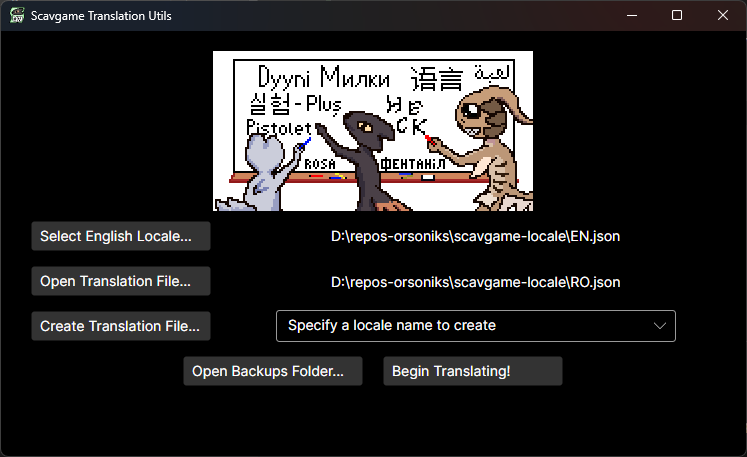
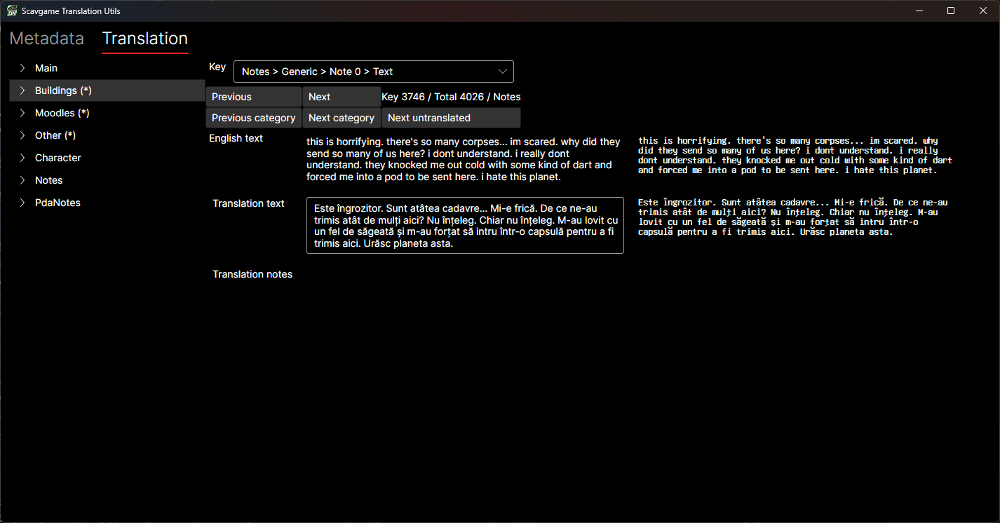

# Scavgame Translation Utils

This is a helper application for translating [Casualties: Unknown](https://orsonik.itch.io/scav-prototype).

If you're looking for the actual translation files currently worked on by the community, go to
the [Orsoniks/scavgame-locale](https://github.com/Orsoniks/scavgame-locale) repository.

# Features

- Simplifies editing translation files for Casualties: Unknown by providing a cleaner interface
- Automatically saves your work as you edit the translation
- Creates backups to avoid accidental data loss
- Sorts the translation keys and indents the JSON file to keep it organized in the same way as the English locale
- Indicates untranslated keys and allows navigating to them for easier maintenance of ongoing translations

# How to use

You can use this application to either create new translations, or to review and update existing translations.

The process is as follows:

1. On the main page, press `Select English Locale...` and point to the english locale file, `EN.json`. You can either
   get the latest version from https://github.com/Orsoniks/scavgame-locale/blob/main/EN.json, or download the game and
   go to `<cas:u install path>/CasualtiesUnknown_Data/Lang/EN.json`
2. Select an existing locale you want to translate with `Select Translation File...` (for example, RO.json), or create a
   new translation file using the `Create Translation File...` button
3. Press `Begin Translating!`, which will open a new window where you can edit the translation
4. Specify a name and description for your translation file in the `Metadata` tab
5. In the `Translation` tab, start translating keys by specifying new text in the `Translation text` input. You can
   compare between the English and the current language, alongside seeing an approximate render to the right
   
   
6. Once done, go back to `Metadata` tab and press `Save Changes and Close`. Keep in mind that while `Enable Autosave` is
   on, changes are saved whenever you update a translation key, or the metadata of the translation

# Planned features

- Provides translation notes that give extra context on some of the translation keys in the locales
- Merge translation files from multiple translators to allow collaborative work
- Improve rendering of translations so that they're closer to the in-game look

# License

This project is licensed under the GPL 3.0. For the license text, see [LICENSE](LICENSE).

Assets and libraries specified in [NOTICE.md](NOTICE.md) are under the respective licenses noted in that file.